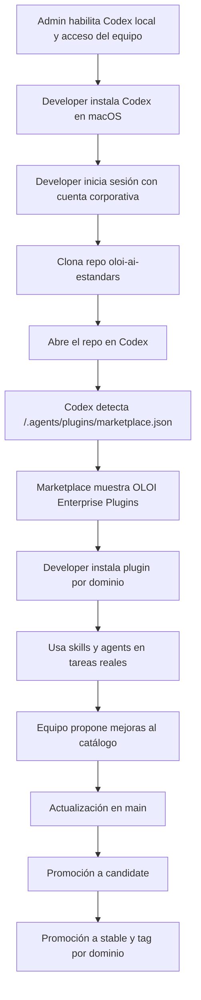

# Codex + OLOI Plugins: tutorial completo de implementación interna

Actualizado: 2026-04-23
Repositorio: [oloidev/oloi-ai-estandars](https://github.com/oloidev/oloi-ai-estandars)

## 1. Objetivo

Este tutorial explica cómo desplegar en la empresa el catálogo privado de plugins de Codex construido en este repositorio, para que el equipo de desarrollo pueda:

- instalar Codex en macOS,
- abrir el repositorio `oloi-ai-estandars`,
- detectar automáticamente el marketplace privado `OLOI Enterprise Plugins`,
- instalar y usar los plugins por dominio,
- trabajar con skills y agents estandarizados para Laravel, Flutter y Product Analyst,
- mantener el catálogo con un flujo controlado de cambios y releases.

## 2. Qué estamos implementando exactamente

Este repositorio ya actúa como un **marketplace privado multi-plugin de Codex**.

Piezas clave:

- Marketplace del repo: `/Users/kamikasu/oloi/oloi-ai-estandars/.agents/plugins/marketplace.json`
- Plugins empaquetados:
  - `/Users/kamikasu/oloi/oloi-ai-estandars/plugins/oloi-laravel`
  - `/Users/kamikasu/oloi/oloi-ai-estandars/plugins/oloi-flutter`
  - `/Users/kamikasu/oloi/oloi-ai-estandars/plugins/oloi-product-analyst`
- Fuente de verdad por dominio:
  - `/Users/kamikasu/oloi/oloi-ai-estandars/laravel`
  - `/Users/kamikasu/oloi/oloi-ai-estandars/flutter`
  - `/Users/kamikasu/oloi/oloi-ai-estandars/product-analyst`
- Gobernanza y releases:
  - `/Users/kamikasu/oloi/oloi-ai-estandars/manifests/`
  - `/Users/kamikasu/oloi/oloi-ai-estandars/changelogs/`
  - `/Users/kamikasu/oloi/oloi-ai-estandars/RELEASE_POLICY.md`
  - `/Users/kamikasu/oloi/oloi-ai-estandars/COMPATIBILITY.md`
  - `/Users/kamikasu/oloi/oloi-ai-estandars/INTERNAL_USE_POLICY.md`

## 3. Arquitectura funcional

### 3.1 Cómo piensa Codex este catálogo

1. Codex abre el repositorio.
2. Detecta el marketplace definido en `/.agents/plugins/marketplace.json`.
3. El marketplace expone plugins locales del repo.
4. Cada plugin apunta a su carpeta `skills/` mediante `.codex-plugin/plugin.json`.
5. Cada skill tiene:
   - `SKILL.md` para instrucciones,
   - `agents/openai.yaml` para metadata visual/UI,
   - `assets/` para iconos.
6. El developer usa el plugin o invoca tareas, y Codex activa la skill adecuada según contexto.

### 3.2 Dominios actuales

- `oloi-laravel`: backend enterprise Laravel.
- `oloi-flutter`: mobile Flutter enterprise.
- `oloi-product-analyst`: análisis funcional, historias de usuario, task breakdown y diseño para Figma.

## 4. Requisitos previos

### 4.1 Requisitos de negocio y acceso

Cada developer necesita:

- acceso al workspace de ChatGPT/Codex de la empresa,
- acceso al repositorio privado `oloidev/oloi-ai-estandars`,
- acceso a GitHub con permisos de lectura del repo,
- Mac con permisos normales de instalación de apps.

### 4.2 Requisitos de OpenAI para empresa

Según la documentación oficial y ayuda de OpenAI:

- el uso de Codex depende del plan de ChatGPT que incluya Codex,
- para Enterprise/Edu, la app de Codex sigue los mismos controles de `Codex local` y `Codex cloud`,
- los admins pueden gobernar acceso desde Workspace settings > Permissions & roles,
- plugins siguen los controles de apps del workspace y RBAC.

Referencias oficiales:

- [Using Codex with your ChatGPT plan](https://help.openai.com/en/articles/11369540-using-codex-with-chatgpt)
- [ChatGPT Enterprise & Edu release notes: Codex app for macOS](https://help.openai.com/en/articles/10128477-chatgpt-enterprise-edu-release-notes)
- [Codex Enterprise Admin Setup](https://developers.openai.com/codex/enterprise/admin-setup)

## 5. Paso 1: preparación del administrador

Este paso lo hace el responsable de plataforma o AI enablement interno.

### 5.1 Confirmar acceso a Codex

Validar que los developers tengan un plan o workspace con Codex habilitado.

### 5.2 Confirmar controles del workspace

Revisar en el workspace:

- que `Codex local` esté habilitado para el equipo que usará la app,
- que los roles correctos tengan acceso,
- que apps/plugins no estén bloqueados por policy interna,
- que GitHub esté autorizado como origen de repositorios de trabajo si también usarán Codex cloud.

### 5.3 Definir política interna

Este repo ya incorpora la política propietaria interna. Debe comunicarse al equipo:

- uso interno únicamente,
- prohibida redistribución fuera de la empresa,
- el repositorio es privado y corporativo,
- la baja de acceso del colaborador implica retiro inmediato del acceso al catálogo.

Documentos internos relevantes:

- `/Users/kamikasu/oloi/oloi-ai-estandars/LICENSE`
- `/Users/kamikasu/oloi/oloi-ai-estandars/INTERNAL_USE_POLICY.md`

## 6. Paso 2: instalación de Codex en macOS

### 6.1 Opción recomendada: Codex app para macOS

OpenAI lanzó la app de Codex para macOS el **2 de febrero de 2026**. La app está pensada para manejar múltiples agentes, worktrees, skills, automations y revisión de cambios desde una misma interfaz.

Referencias oficiales:

- [Codex app release note](https://help.openai.com/en/articles/10128477-chatgpt-enterprise-edu-release-notes)
- [Using Codex with your ChatGPT plan](https://help.openai.com/en/articles/11369540-using-codex-with-chatgpt)

### 6.2 Procedimiento de instalación

1. Ir al acceso oficial de descarga de Codex desde ChatGPT/OpenAI.
2. Descargar la app para macOS.
3. Abrir el instalador.
4. Mover la app a `Applications` si macOS lo solicita.
5. Abrir Codex.
6. Iniciar sesión con la cuenta corporativa de ChatGPT.
7. Confirmar que la cuenta tiene acceso a Codex.

### 6.3 Validación inmediata

Después de iniciar sesión, el developer debe poder:

- abrir proyectos locales,
- ver la interfaz principal de Codex,
- usar tareas locales,
- abrir repositorios desde disco.

## 7. Paso 3: alternativa opcional para equipo técnico avanzado

Si alguien también quiere la CLI de apoyo, OpenAI documenta la instalación de la **Codex CLI** con:

```bash
npm i -g @openai/codex
codex
```

Referencia oficial:

- [Codex CLI](https://developers.openai.com/codex/cli)

Esto no reemplaza la app de macOS para la demo de mañana; sirve como complemento para usuarios avanzados.

## 8. Paso 4: clonar el repositorio corporativo

En macOS:

```bash
git clone git@github.com:oloidev/oloi-ai-estandars.git
cd oloi-ai-estandars
```

Si la empresa usa HTTPS en vez de SSH:

```bash
git clone https://github.com/oloidev/oloi-ai-estandars.git
cd oloi-ai-estandars
```

## 9. Paso 5: abrir el repo en Codex

### 9.1 Flujo recomendado

1. Abrir la app de Codex.
2. Elegir `Open project` o equivalente.
3. Seleccionar la carpeta local `oloi-ai-estandars`.
4. Esperar a que Codex indexe el workspace.

### 9.2 Qué debe detectar Codex

Codex debe leer el marketplace local del repo:

- `/Users/kamikasu/oloi/oloi-ai-estandars/.agents/plugins/marketplace.json`

Ese marketplace expone tres plugins:

- `oloi-laravel`
- `oloi-flutter`
- `oloi-product-analyst`

## 10. Paso 6: validar que los plugins aparecen

### 10.1 Qué revisar en la UI

El developer debe ver el marketplace:

- `OLOI Enterprise Plugins`

Y dentro del marketplace:

- `OLOI Laravel`
- `OLOI Flutter`
- `OLOI Product Analyst`

### 10.2 Qué hacer si no aparecen

1. Confirmar que el repo abierto sea `oloi-ai-estandars`.
2. Confirmar que exista `/.agents/plugins/marketplace.json`.
3. Confirmar que cada plugin tenga `.codex-plugin/plugin.json`.
4. Cerrar y reabrir el proyecto en Codex.
5. Reiniciar la app de Codex si la UI estaba cacheada.

## 11. Paso 7: instalar y usar los plugins

### 11.1 Plugin Laravel

Casos típicos de uso:

- crear endpoints,
- escribir tasks backend,
- aplicar arquitectura hexagonal,
- testing en Laravel,
- policies, observabilidad, performance y eventos de dominio.

Ejemplos de prompts:

- `Use OLOI Laravel to create a new endpoint for updating a user profile.`
- `Use $laravel-endpoint-creation to implement a PATCH profile endpoint.`
- `Use $laravel-testing-standard to define regression coverage for this backend task.`

### 11.2 Plugin Flutter

Casos típicos de uso:

- features mobile,
- Riverpod por defecto,
- BLoC para workflows complejos,
- Dio para REST,
- testing, performance, CI/CD y seguridad.

Ejemplos:

- `Use OLOI Flutter to implement a profile edit flow end to end.`
- `Use $flutter-mobile-orchestrator to decide the right Flutter skills for this task.`
- `Use $flutter-testing-standard to generate unit, widget and integration test coverage.`

### 11.3 Plugin Product Analyst

Casos típicos:

- historias de usuario,
- task breakdown por stack,
- diseño orientado a Figma.

Ejemplos:

- `Use OLOI Product Analyst to convert this requirement into a sprint-ready user story.`
- `Use $product-analyst-task-breakdown-writer to create implementation tasks for web, backend and mobile.`
- `Use $product-analyst-figma-design-generator to turn this idea into a Figma-ready design plan.`

## 12. Cómo está organizado el catálogo para crecer sin romperse

## 12.1 Fuente de verdad vs distribución

La empresa debe mantener esta regla:

- las carpetas por dominio (`laravel/`, `flutter/`, `product-analyst/`) son la fuente de verdad,
- la carpeta `plugins/` es la versión empaquetada para distribución dentro de Codex.

## 12.2 Flujo de branches

Este repo ya usa un flujo de catálogo:

- `main`: integración
- `candidate`: pre-release
- `stable`: release estable

## 12.3 Versionado por dominio

Ya existen artifacts de catálogo:

- `/Users/kamikasu/oloi/oloi-ai-estandars/manifests/laravel.json`
- `/Users/kamikasu/oloi/oloi-ai-estandars/manifests/flutter.json`
- `/Users/kamikasu/oloi/oloi-ai-estandars/manifests/product-analyst.json`

Tags por dominio:

- `laravel-vX.Y.Z`
- `flutter-vX.Y.Z`
- `product-analyst-vX.Y.Z`

## 13. Flujo operativo recomendado para developers

### 13.1 Flujo diario

1. Abrir el repo de producto real en Codex.
2. Si necesitan consultar o evolucionar estándares, abrir `oloi-ai-estandars`.
3. Invocar el plugin o skill por nombre o por intención.
4. Ejecutar la tarea con contexto de negocio completo.
5. Revisar diff, pruebas y salida.
6. Hacer commit y PR normalmente.

### 13.2 Flujo para crear nuevas skills

1. Crear skill nueva en el dominio correcto.
2. Seguir convención de nombres por dominio.
3. Registrar agent/skill en el dominio correspondiente.
4. Añadir assets y `agents/openai.yaml`.
5. Sincronizar a `plugins/<plugin>/skills`.
6. Actualizar manifest y changelog del dominio.
7. Promover por `main -> candidate -> stable`.

## 14. Flujograma de adopción interna



## 15. Troubleshooting

### 15.1 El plugin no aparece

Causas probables:

- repo incorrecto abierto,
- caché de la app,
- `marketplace.json` no detectado,
- `plugin.json` inválido,
- el developer abrió una copia vieja del repo.

Acción:

- verificar estructura,
- hacer pull,
- reiniciar Codex,
- reabrir el proyecto.

### 15.2 El developer tiene Codex pero no puede usar plugins

Revisar:

- controles del workspace,
- acceso del rol,
- si apps/plugins están permitidos,
- si la cuenta es la corporativa correcta.

### 15.3 Las skills no se ven completas o sin iconos

Revisar:

- `agents/openai.yaml`
- `assets/`
- sincronización entre dominio fuente y `plugins/`

### 15.4 El repo abre, pero el catálogo no coincide con producción

Revisar branch:

- para demo o adopción estable, abrir `stable` o el tag aprobado,
- no usar `main` si hay cambios en curso que no están listos para toda la empresa.

## 16. Buenas prácticas internas para la conferencia

### 16.1 Qué debes remarcar al equipo

- esto no es un repositorio de código de producto; es un repositorio de estandarización operativa,
- el valor no está solo en las skills, sino en la gobernanza del catálogo,
- la separación por dominio evita mezclar Laravel, Flutter y análisis funcional,
- el marketplace interno reduce copia manual y estandariza la activación de expertise.

### 16.2 Qué no prometer

No prometas que:

- Codex reemplaza el criterio técnico,
- cualquier prompt ambiguo producirá salida perfecta,
- la licencia sola impide reutilización externa.

Sí puedes afirmar que:

- el catálogo baja la variabilidad técnica,
- acelera tareas recurrentes,
- mejora consistencia entre equipos,
- deja un camino escalable para más dominios: Next.js, Django, Design, QA, etc.

## 17. Demo sugerida para mañana

### Demo 1: backend

Prompt:

`Use OLOI Laravel to create a production-safe endpoint for updating the authenticated user profile.`

### Demo 2: mobile

Prompt:

`Use OLOI Flutter to plan and implement a profile edit feature with Riverpod, Dio and tests.`

### Demo 3: análisis

Prompt:

`Use OLOI Product Analyst to turn this requirement into a user story and stack-aware implementation tasks.`

## 18. Checklist final para rollout interno

- [ ] Workspace con Codex habilitado
- [ ] Developers con cuenta corporativa
- [ ] Repo privado accesible
- [ ] Codex app instalada en macOS
- [ ] Repo abierto en Codex
- [ ] Marketplace `OLOI Enterprise Plugins` visible
- [ ] Plugins visibles por dominio
- [ ] Demo de 3 casos validada
- [ ] Branch estable definida para adopción
- [ ] Política interna de uso comunicada

## 19. Fuentes oficiales

- [Build plugins – Codex](https://developers.openai.com/codex/plugins/build)
- [Using Codex with your ChatGPT plan](https://help.openai.com/en/articles/11369540-using-codex-with-chatgpt)
- [ChatGPT Enterprise & Edu release notes](https://help.openai.com/en/articles/10128477-chatgpt-enterprise-edu-release-notes)
- [Codex CLI](https://developers.openai.com/codex/cli)
- [Codex Enterprise Admin Setup](https://developers.openai.com/codex/enterprise/admin-setup)

## 20. Resumen ejecutivo de una frase

La empresa ya no distribuye prompts sueltos: distribuye expertise empaquetada como plugins privados de Codex, gobernada por dominio, versión y política interna.
